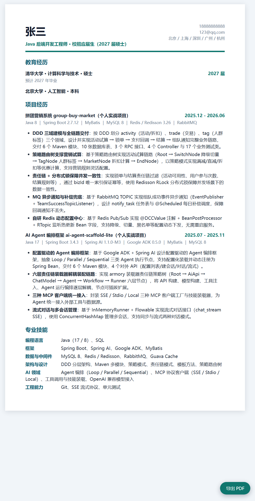
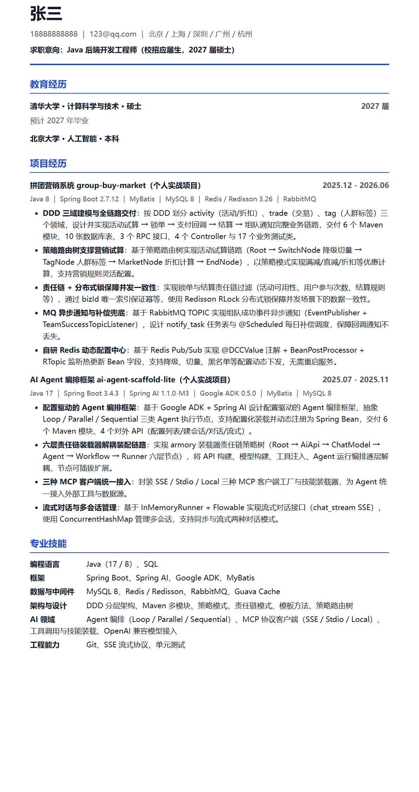

# technical-resume-optimizer ｜ 技术岗简历优化与生成

> 一个面向技术岗位的简历生成与优化技能。它坚持“只写有证据的事实”——简历中的每个项目、数字、技术都能回溯到你的工作区源码或明确确认，从根上杜绝 AI 编造经历。
> 基于**可追溯真实证据**生成、评分与优化技术岗简历的通用 Agent Skill（Agent 技能）。
> 支持后端、前端、全栈、移动端、测试、数据、算法/机器学习、AI Agent、DevOps/SRE、云原生、安全、嵌入式等岗位。

[](https://github.com/superyeda/technical-resume-optimizer)
[](#license)
[](CONTRIBUTING.md)

---

## 为什么需要它

普通 AI 写简历最大的问题是**编造**——QPS、用户数、性能提升张口就来，面试一问就穿帮。

本技能坚持一条铁律：**只写有证据的事实**。简历上的每一句话、每一个数字，都能回溯到你的工作区源码、文档或你的明确确认。它不替你吹牛，但帮你把真实的亮点写得清楚、专业、可验证。

## 功能特性

- 📂 **三种场景全覆盖**：单份简历评分优化（A）、从工作区生成简历（B）、增量更新简历（C）
- 🧱 **Resume IR 事实中间层**：所有简历内容先沉淀为带来源的结构化 IR，再渲染成简历，杜绝凭空发挥
- 🏷️ **证据分级**：用户确认 / 材料明确记录 / 可计算推导 / 待确认，只有前两级可直接写入简历
- 📄 **四件套交付**：Markdown 主稿 + ATS 单列 HTML + 现代视觉 HTML + 评估报告
- 📊 **100 分制评分**：内容质量 30 / 结构与排版 25 / 语言与语法 20 / ATS 优化 15 / 影响力与印象 10
- 🔍 **ATS 友好**：单列结构、纯文本联系方式、标准栏目名、日期格式统一，可直接投递
- 🖨️ **A4 打印**：两份 HTML 均内置打印样式，一键导出 PDF
- 📈 **指标覆盖**：优先量化吞吐、性能、稳定性、成本、效率、质量、交付范围与业务影响
- ✍️ **可扫描性**：项目 bullet 句首加简练加粗总结（highlight），HR 3 秒看懂核心价值
- 🔄 **增量协议**：保留全部历史版本，新证据只更新对应章节，不擅自改动措辞强度

## 快速开始

### 安装（作为通用 Agent Skill）

本技能遵循通用 Agent Skill 结构（`SKILL.md` 主文件 + `references/` 参考文档 + `scripts/` 脚本 + `assets/` 模板），可运行在支持 Skills 机制的任意 AI Agent 中，如 Claude Code、Cursor、CodeBuddy / WorkBuddy 等。

将本仓库克隆到目标 Agent 的技能目录：

```bash
# Claude Code（macOS / Linux）
git clone https://github.com/superyeda/technical-resume-optimizer.git \
  ~/.claude/skills/technical-resume-optimizer

# Cursor（macOS / Linux）
git clone https://github.com/superyeda/technical-resume-optimizer.git \
  ~/.cursor/skills/technical-resume-optimizer

# WorkBuddy（Windows）
git clone https://github.com/superyeda/technical-resume-optimizer.git \
  %USERPROFILE%\.workbuddy\skills\technical-resume-optimizer
```

在 Agent 对话中输入（以 WorkBuddy 为例）：

```
/technical-resume-optimizer 帮我生成一份求职简历
```

### 使用（三句话上手）

| 场景 | 说一句话 | 你会得到 |
|---|---|---|
| A 优化已有简历 | 「帮我优化这份 PDF 简历，目标岗位是 Java 后端」 | 精修稿 + 评分报告 |
| B 从工作区生成 | 「根据这个项目文件夹生成简历」 | 全新简历 + 证据覆盖表 |
| C 增量更新 | 「我新做了个实习项目，更新简历」 | 新版本 + 增量变更报告 |

## 交付物

每次任务交付以下文件（输出到工作区 `outputs/`）：

```
姓名-目标岗位-版本日期-简历.md            # Markdown 主稿
姓名-目标岗位-版本日期-简历-ATS.html      # 单列 ATS 版（可 A4 打印 PDF）
姓名-目标岗位-版本日期-简历-现代.html     # 现代视觉版（可 A4 打印 PDF）
姓名-目标岗位-版本日期-评估报告.md        # 评分 / 证据缺口 / 待确认项 / 行动计划
resume_ir_vN.yaml                         # Resume IR 事实中间层（版本化）
source_manifest_vN.json                   # 来源清单（版本化）
```

增量更新（场景 C）额外输出 `姓名-目标岗位-版本日期-增量变更报告.md`。

## 示例展示

> 以下示例为演示数据（姓名、联系方式、教育背景均为占位），演示「从工作区生成简历」的完整产出。

| 现代视觉版 | ATS 单列版 |
| :---: | :---: |
|  |  |

📁 [examples/demo-java-backend/](examples/demo-java-backend/)

| 文件 | 说明 |
|---|---|
| [简历.md](examples/demo-java-backend/简历.md) | Markdown 主稿，可直接预览 |
| [简历-ATS.html](examples/demo-java-backend/简历-ATS.html) | ATS 单列版，浏览器打开后 Ctrl+P 导出 PDF |
| [简历-现代.html](examples/demo-java-backend/简历-现代.html) | 现代视觉版，浏览器打开后 Ctrl+P 导出 PDF |
| [评估报告.md](examples/demo-java-backend/评估报告.md) | 评分 80/100（B+）、五维明细、证据覆盖表、待确认项 |
| [resume_ir_v1.yaml](examples/demo-java-backend/resume_ir_v1.yaml) | 事实中间层：每条 bullet 的 situation/action/result/evidence |
| [source_manifest_v1.json](examples/demo-java-backend/source_manifest_v1.json) | 来源清单：哪些文件支撑了哪些断言 |

### 产出效果预览（来自示例）

项目经历 bullet 采用「加粗总结 + 动作 + 技术 + 结果」结构：

> **DDD 三域建模与全链路交付**：按 DDD 划分 activity / trade / tag 三个领域，设计并实现活动试算 → 锁单 → 支付回调 → 结算 → 组队通知完整业务链路，交付 6 个 Maven 模块、10 张数据库表、3 个 RPC 接口、4 个 Controller 与 17 个业务测试类。
>
> **责任链 + 分布式锁保障并发一致性**：实现锁单与结算责任链过滤，通过 bizId 唯一索引保证幂等，使用 Redisson RLock 分布式锁保障并发场景下的数据一致性。

评估报告给出可执行的改进建议（P0/P1/P2 优先级），例如：

> - P0 补充教育起止年月、确认专业名
> - P1 补充 GitHub / 开源链接、实习/竞赛/证书
> - P2 项目时间对应关系确认

## 目录结构

```
technical-resume-optimizer/
├── SKILL.md                        # 技能主文件：场景判定、规则、流程
├── references/
│   ├── technical-resume-principles.md   # 写作原则（含 bullet 加粗总结规范）
│   ├── ats-and-pdf-checklist.md         # ATS 与 PDF 检查清单
│   ├── metric-and-evidence-guide.md     # 指标与证据分级（A/B/C/D）
│   ├── resume-ir-schema.md              # Resume IR 字段规范
│   ├── jd-tailoring.md                  # JD 解析与定制
│   ├── chinese-english-typesetting.md   # 中英文混排规范
│   ├── incremental-update-protocol.md   # 增量更新协议
│   └── role-profiles/                   # 岗位画像（后端/前端/AI/测试等）
├── assets/
│   ├── html-ats-single-column-template.html   # ATS 模板
│   ├── html-modern-template.html              # 现代模板
│   └── css/print-a4.css                       # A4 打印样式
├── scripts/
│   ├── scan_workspace_manifest.py    # 工作区只读扫描
│   └── validate_resume_output.py     # 交付物完整性校验
└── examples/
    └── demo-java-backend/            # 完整示例产出
```

## 工作流程

```
用户指定工作区 + 目标岗位
        │
        ▼
① 扫描工作区（只读，过滤构建产物/密钥/日志）
        │
        ▼
② 建立证据卡片（问题/动作/方案/结果/指标/来源/置信度）
        │
        ▼
③ 集中询问 3–6 个高价值问题（姓名/岗位/归属/关键指标）
        │
        ▼
④ 构建 Resume IR（事实中间层，全部带来源）
        │
        ▼
⑤ 按岗位画像生成 Markdown + ATS HTML + 现代 HTML
        │
        ▼
⑥ 输出评估报告 + 运行校验脚本 + 事实回溯
```

## 设计原则

1. **真实性优先**：不编造公司、岗位、项目、技术、数字、规模、个人贡献或时间；团队成果必须标注「参与/团队/独立负责」。
2. **证据分级**：`用户确认 A` > `材料明确记录 B` > `可计算推导 C（需确认）` > `待确认 D（禁止写入）`。
3. **强表达**：bullet 遵循「强动作动词 + 个人动作 + 技术/方法 + 可验证结果」，不写「负责/参与/熟悉」式空话（除非事实如此）。
4. **可扫描**：标准栏目、倒序时间线、加粗总结短语、量化优先、ATS 单列。
5. **可追溯**：每个断言都能回溯到源码文件、文档或用户确认，无法确认的列入待确认项而非悄悄补写。

## 技术栈

- 纯 Python 脚本（标准库，零依赖）
- HTML/CSS（内联样式，双模板）
- YAML（Resume IR）/ JSON（来源清单）
- 平台无关：不依赖任何特定 Agent 框架 API，仅用文件读写与标准 Python，开箱即用

## 贡献

欢迎通过 Issue / PR 参与贡献：

- 新增岗位画像（`references/role-profiles/`）
- 优化写作原则与模板
- 补充测试与校验脚本
- 完善示例与文档

提交前请确保：不引入编造性引导、不破坏 ATS 兼容性、示例数据使用占位信息。

## License

[MIT](LICENSE)

---

<p align="center">Built for honest, evidence-based resumes. 让简历经得起追问。</p>
